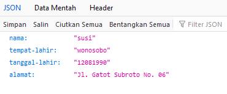
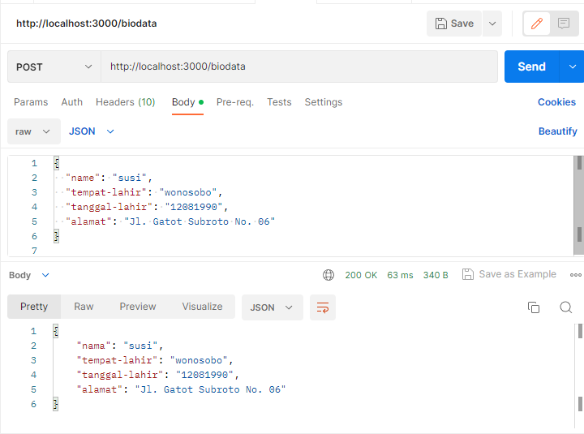

# tugas2-urlParameter
tugas 2 express.js ALKADEMI

# Cara akses
untuk mengakses methode GET 
http://localhost:3000/biodata?name=susi&tempat-lahir=wonosobo&tanggal-lahir=12081990&alamat=Jl.%20Gatot%20Subroto%20No.%2006

untuk mengakses methode POST
url : http://localhost:3000/biodata
body :{
  "name": "susi",
  "tempat-lahir": "wonosobo",
  "tanggal-lahir": "12081990",
  "alamat": "Jl. Gatot Subroto No. 06"
}
