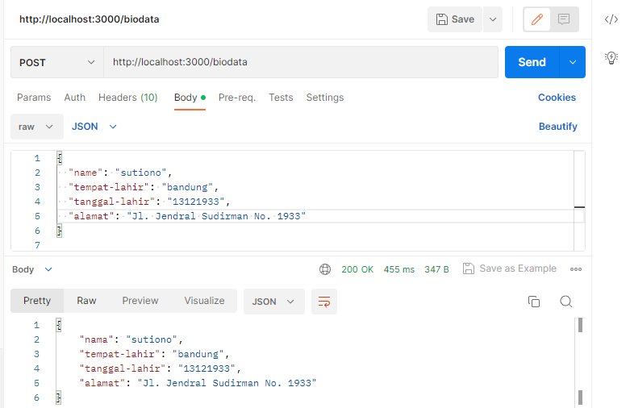

# tugas2-urlParameter
tugas 2 express.js ALKADEMI

# Cara akses
untuk mengakses methode GET 
http://localhost:3000/biodata?name=Sutiono&tempat-lahir=Bandung&tanggal-lahir=13121933&alamat=Jl.%20Jendral%20Sudirman%20No.%201933

untuk mengakses methode POST
url : http://localhost:3000/biodata
body :{
  "name": "sutiono",
  "tempat-lahir": "bandung",
  "tanggal-lahir": "13121933",
  "alamat": "Jl. Gatot Subroto No. 1933"
}
